# harmBounds

The harmBounds package calculates stopping probabilities, defines
stopping boundaries and generates plots for safety monitoring using an
event based approach.

The idea is that under the null hypothesis of no safety concern, safety
events are expected to occur at a frequency proportional to the
randomization ratio. Assuming a single event per patient, we can do one
sample binomial exact tests on the proportion of events in the treatment
arm. In case of several events, we can use a beta-binomial framework,
assuming a certain intra-class correlation coefficient. Evidence that
the proportion of events in the treatment arm is higher than what is
expected from randomization indicates a safety problem.

The safety monitoring can be done continuously after every event or at a
pre-specified total number of events. The nominal test-wise alpha would
be calibrated to obtain desired properties, such as a certain proportion
of stopping under alternative scenarios of some degree of safety
problems (the power). An overall type I error control can also be
implemented but we would usually not recommend that for safety testing,
as the consequence of a type II error (not stopping for safety if the
treatment is not safe) is arguably worse than of a type I error
(stopping if the treatment is safe).

The procedure is computationally efficient and fully reproducible, as
all calculations are exact and derived in closed form from the binomial
or the beta-binomial distribution.

## Calculation of boundaries

Stopping boundaries can be calculated with function `getHarmBound`.
Let’s assume a trial with 10 safety interim analyses after every 10
events (combined over both arms) up to a total of 100 events and a
nominal test-wise alpha of 0.025.

``` r

hb<-getHarmBound(nevents = seq(10, 100, by = 10), alpha_test = 0.025, pH0 = 0.5)
hb
#> $bounds
#>    events events_treatment events_control alpha_test
#> 1      10                9              1      0.025
#> 2      20               15              5      0.025
#> 3      30               21              9      0.025
#> 4      40               27             13      0.025
#> 5      50               33             17      0.025
#> 6      60               39             21      0.025
#> 7      70               44             26      0.025
#> 8      80               50             30      0.025
#> 9      90               55             35      0.025
#> 10    100               61             39      0.025
#> 
#> $stopprob
#> $stopprob$`0.5`
#>    events  pH hyp   stop_prob cum_stop_prob
#> 1      10 0.5  H0 0.010742188    0.01074219
#> 2      20 0.5  H0 0.016405106    0.02714729
#> 3      30 0.5  H0 0.011266726    0.03841402
#> 4      40 0.5  H0 0.007307253    0.04572127
#> 5      50 0.5  H0 0.004798221    0.05051949
#> 6      60 0.5  H0 0.003217823    0.05373732
#> 7      70 0.5  H0 0.006730864    0.06046818
#> 8      80 0.5  H0 0.003002399    0.06347058
#> 9      90 0.5  H0 0.005713749    0.06918433
#> 10    100 0.5  H0 0.002449994    0.07163432
#> 
#> 
#> $opchar
#>     p cum_stop_prob expected_events hyp
#> 1 0.5    0.07163432        95.80595  H0
#> 
#> attr(,"class")
#> [1] "harmbound" "list"
```

The data frame *bounds* specifies the boundaries at each interim
analysis, *events_treatment* is the minimal number of events in the
treatment arm that would lead to a stopping of the trial. The list
*stopprob* contains stopping probability at each analysis for the null
and optionally alternative hypotheses (see below). Data frame *opchar*
shows the cumulative stopping probability and the expected number of
events for each hypothesis.

In the example above, the overall type I error of the safety testing is
7.2%. The expected number of events (i.e. the average if the trial would
be repeated) is 96. Typically, the trial might not be stopped at the
last interim analysis, which can be specified using the *maxevents*
option. The option only influences the expected events.

``` r

hb<-getHarmBound(nevents = seq(10, 100, by = 10), alpha_test = 0.025, pH0 = 0.5,
  maxevents = 150)
hb$opchar
#>     p cum_stop_prob expected_events hyp
#> 1 0.5    0.07163432        142.2242  H0
```

## Alternative specification of rejection criteria

Instead of using an alpha for each test, we can also control the
family-wise type I error rate at a specific level (even though we do not
necessarily recommend that). Refer to the section on [Choosing the
test-wise alpha](#sec-alpha) for more details.

``` r

hb<-getHarmBound(nevents = seq(10, 100, by = 10), alpha_total = 0.05, pH0 = 0.5,
  maxevents = 150)
hb$opchar
#>     p cum_stop_prob expected_events hyp
#> 1 0.5    0.05104241        144.7846  H0
```

The overall stopping probability under H0 (the type I error) is 5.1%,
i.e. as close to 5% as possible (given the discrete nature of the
test).If a strict control at 5% would required a *alpha_total* of 0.049
would have to be chosen.

Another more sensible option would be to target the type II error (or
the power) for a specific alternative. This option requires the
specification of an alternative, e.g. assuming that 60% of the events
occuring in the experimental arm would indicate a safety problem (see
the section on [Operating characteristics](#sec-opchar) for more details
about the alternatives).

``` r

hb<-getHarmBound(nevents = seq(10, 100, by = 10), power = 0.8, 
  pH0 = 0.5, pH1 = 0.6, maxevents = 150)
hb$opchar
#>     p cum_stop_prob expected_events hyp
#> 1 0.5     0.1980100       127.73727  H0
#> 2 0.6     0.8018467        62.47206  H1
```

Specifying *alpha_total* or *power* is much slower as it relies on an
iterative procedure ro determine the alpha used at each step. It could
make sense to first determine the *alpha_test* and then use it directly
in `getHarmBound`.

This can be done separately using function `getAlphaPerTest`:

``` r

alphaPerTest<-getAlphaPerTest(nevents = seq(10, 100, by = 10), 
  alpha_total = 0.05, pH0 = 0.5)

alphaPerTest
#> [1] 0.01760014

alphaPerTest<-getAlphaPerTest(nevents = seq(10, 100, by = 10),
  power = 0.8,  pH0 = 0.5, pH1 = 0.6)

alphaPerTest
#> [1] 0.07693005
```

## Plotting of the boundaries

The boundaries can be plotted using `harmboundPlot` (or the
harmbound.plot-method):

``` r

hb<-getHarmBound(nevents = seq(10, 100, by = 10), alpha_test = 0.025, pH0 = 0.5,
  maxevents = 150)
plot(hb)
```

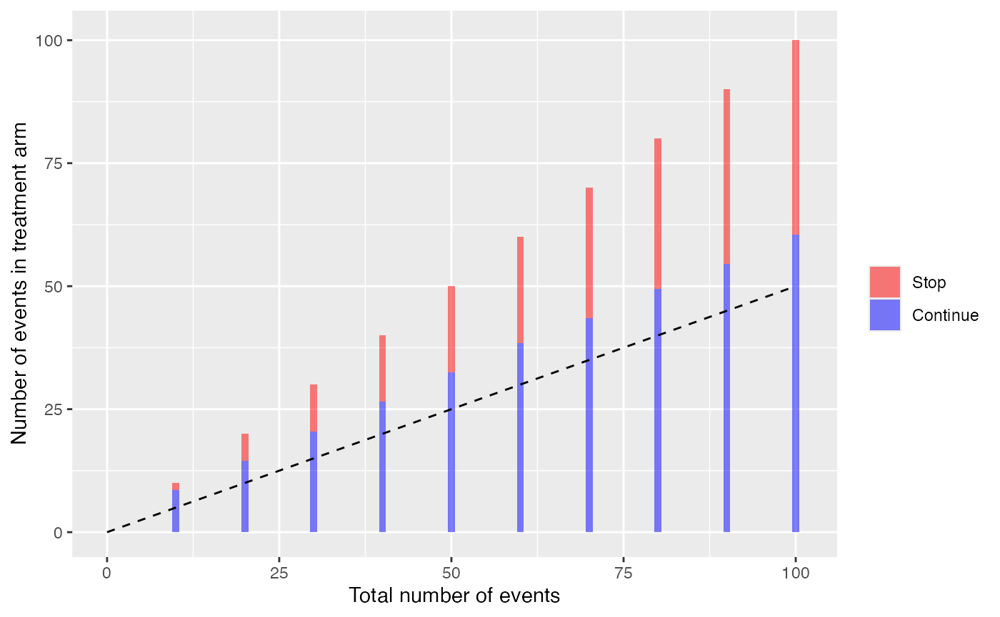

Where the bars indicate the time points of the interim analysis with the
rejection region in red, and the dashed line represents the expectation
(can be removed with ‘H0line = FALSE’)

Continuous monitoring could also be implemented:

``` r

hb<-getHarmBound(nevents = 0:100, alpha_test = 0.025, pH0 = 0.5, 
  maxevents = 150)
plot(hb) 
```

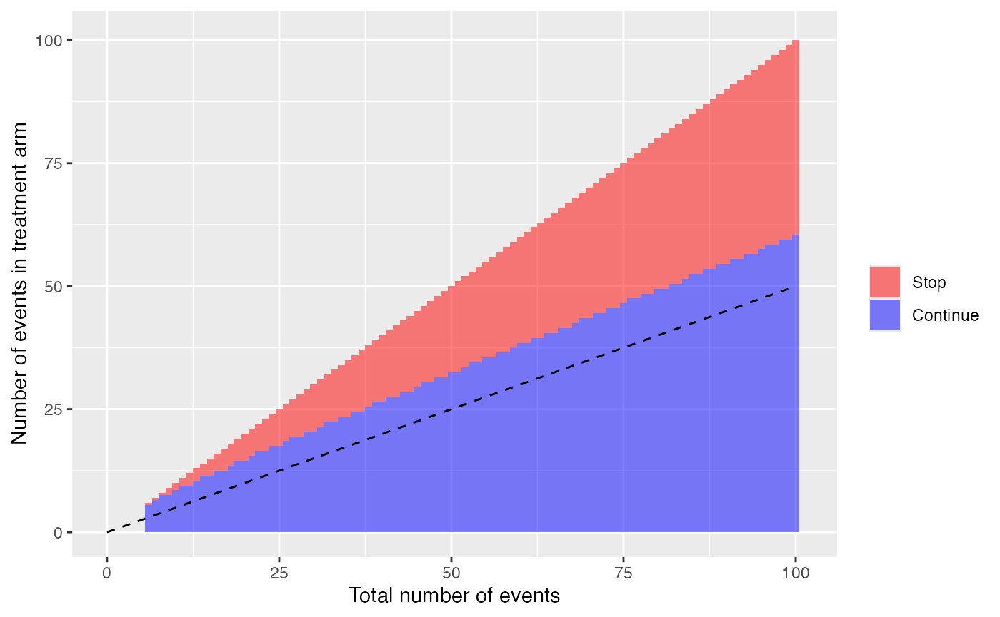

Observed data can be added as vector with 0 and 1, indicated the
sequence of the arms in which events occurred (0 being the control and 1
the treatment arm). In this example, the boundary is not breached.

``` r

set.seed(123)
eventgroups<-rbinom(n = 100, size = 1, prob = 0.5)
plot(hb,observed=eventgroups) 
```


## Operating characteristics

Stopping probabilities and expected number of events can be obtained for
alternative scenarios with the `getHarmBound` function. The alternative
hypothesis can be specified as

- pH1: the proportion of the events in the treatment arm, with 0.5 being
  the null scenario for a 1:1 rando, and numbers from 0.5 to 1
  indicating a safety problem.

- rrH1: the risk ratio (treatment / control), with 1 being the null
  scenario and numbers \>1 indicating a safety problem.

- rdH1: the risk difference (treatment minus control), with 0 being the
  null scenario and numbers \>0 indicating a safety problem. Here the
  control proportion (r0) has to be specified.

- orH1: the odds ratio (treatment / control), with 1 being the null
  scenario and number \>1 indicating a safety problem. Here the control
  proportion (r0) has to be specified.

To stay in the event-based setting, we recommend using the first two
options (pH1 or rrH1).

``` r

#with proportion of events in the treatment arm:
hb<-getHarmBound(nevents = seq(10, 100, by = 10), alpha_test = 0.025, pH0 = 0.5,
  pH1 = 0.6, maxevents = 150)
hb
#> $bounds
#>    events events_treatment events_control alpha_test
#> 1      10                9              1      0.025
#> 2      20               15              5      0.025
#> 3      30               21              9      0.025
#> 4      40               27             13      0.025
#> 5      50               33             17      0.025
#> 6      60               39             21      0.025
#> 7      70               44             26      0.025
#> 8      80               50             30      0.025
#> 9      90               55             35      0.025
#> 10    100               61             39      0.025
#> 
#> $stopprob
#> $stopprob$`0.5`
#>    events  pH hyp   stop_prob cum_stop_prob
#> 1      10 0.5  H0 0.010742188    0.01074219
#> 2      20 0.5  H0 0.016405106    0.02714729
#> 3      30 0.5  H0 0.011266726    0.03841402
#> 4      40 0.5  H0 0.007307253    0.04572127
#> 5      50 0.5  H0 0.004798221    0.05051949
#> 6      60 0.5  H0 0.003217823    0.05373732
#> 7      70 0.5  H0 0.006730864    0.06046818
#> 8      80 0.5  H0 0.003002399    0.06347058
#> 9      90 0.5  H0 0.005713749    0.06918433
#> 10    100 0.5  H0 0.002449994    0.07163432
#> 
#> $stopprob$`0.6`
#>    events  pH hyp  stop_prob cum_stop_prob
#> 1      10 0.6  H1 0.04635740     0.0463574
#> 2      20 0.6  H1 0.09503665     0.1413940
#> 3      30 0.6  H1 0.08037764     0.2217717
#> 4      40 0.6  H1 0.06377080     0.2855425
#> 5      50 0.6  H1 0.05117939     0.3367219
#> 6      60 0.6  H1 0.04194665     0.3786685
#> 7      70 0.6  H1 0.07679694     0.4554655
#> 8      80 0.6  H1 0.03922701     0.4946925
#> 9      90 0.6  H1 0.06524712     0.5599396
#> 10    100 0.6  H1 0.03194760     0.5918872
#> 
#> 
#> $opchar
#>     p cum_stop_prob expected_events hyp
#> 1 0.5    0.07163432        142.2242  H0
#> 2 0.6    0.59188721         91.2001  H1
#> 
#> attr(,"class")
#> [1] "harmbound" "list"
```

Note that *stopprob* is now of length two with a data frame for each
condition.

We would stop in 7.2% of the trials under the null (no safety problem)
and in 59.2% under the alternative (safety problem with 60% of the
events in the treatment arm). Because of the higher probability of early
stopping, the expected number of events is reduced from 142 under H0 to
91 under H1.

The (cumulative) stopping probabilities at each step can be plotted
using *absstopPlot* or *cumstopPlot* (or the harmbound.plot-methods). We
now using more than one alternative to make it more interesting:

``` r

hb<-getHarmBound(nevents = seq(10, 100, by = 10), alpha_test = 0.025, 
  pH0 = 0.5, pH1 = c(0.6, 0.7, 0.8) , maxevents = 150)
plot(hb, which = "abs_stopping")
```

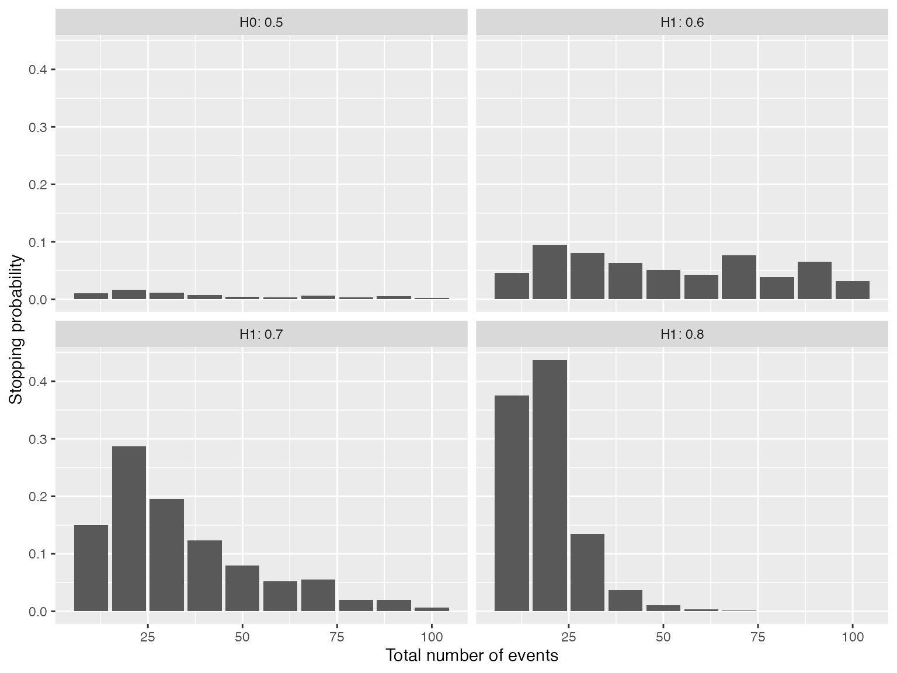

``` r

plot(hb, which = "cum_stopping")
```

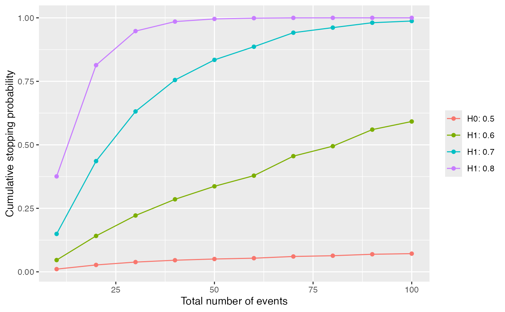

We can also specify a vector of alternatives and plot the cumulative
stopping probabilities or the expected number of events for each
alternative.

``` r

hb<-getHarmBound(nevents = seq(10, 100, by = 10), alpha_test = 0.025, pH0 = 0.5, 
  pH1 = seq(0,1,l=100), maxevents = 150)
plot(hb, which = "opchar_stop")
```

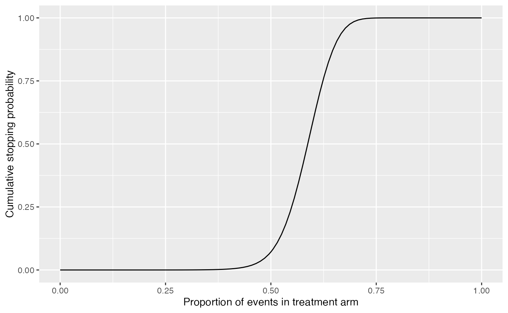

``` r

plot(hb, which = "opchar_n")
```

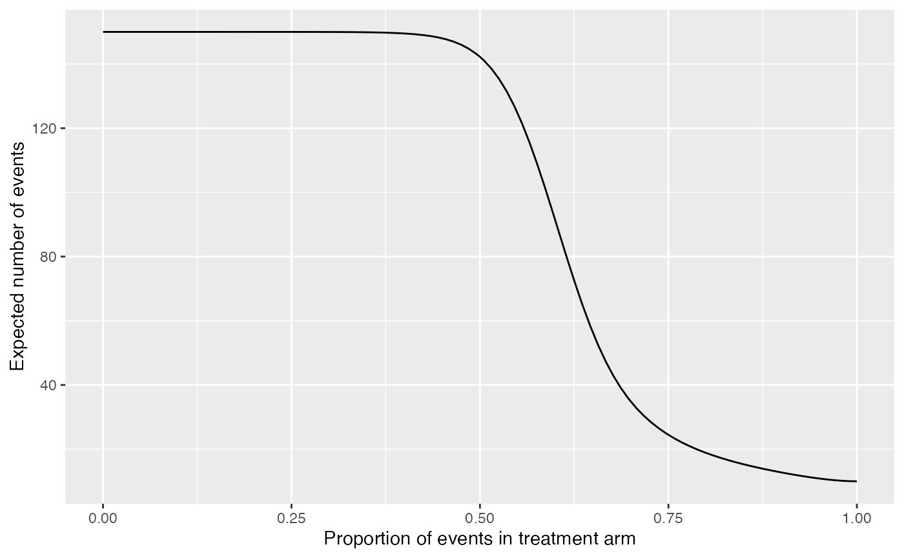

## Choosing the test-wise alpha

To choose the test-wise alpha, we recommend to control the power rather
than the type I error. I.e. to check that a sufficient proportion of
trials are stopped under an appropriate alternative hypothesis
(reflecting a safety problem).

A target power can be specified directly in `getHarmbound` (see above).

To get a more complete picture, we would check the stopping
probabilities for a grid of alphas:

``` r

alphaPerTest <- getAlphaPerTest(nevents = seq(10, 100, by = 10), pH0 = 0.5,
  alpha_total = 0.05)
alist<-c(0.001,0.01,alphaPerTest,0.025,0.05)

hbl<-lapply(alist,function(x)
  getHarmBound(nevents = seq(10, 100, by = 10), alpha_test = x,
  pH0 = 0.5, pH1 = seq(0,1,l=100), maxevents = 150)$opchar)

hbd<-data.frame(do.call(rbind,hbl),alpha=rep(alist,each=nrow(hbl[[1]])))
hbd$alpha<-as.factor(round(hbd$alpha,4))

ggplot(hbd, aes(x = p, y = cum_stop_prob, colour=alpha)) + 
    geom_line() +
    ylab("Stopping probability") +
    xlab("Proportion of events in treatment arm") +
    scale_x_continuous(breaks=seq(0,1,by=0.1),limits=c(0.2,0.8)) +
    scale_y_continuous(breaks=seq(0,1,by=0.2))
```

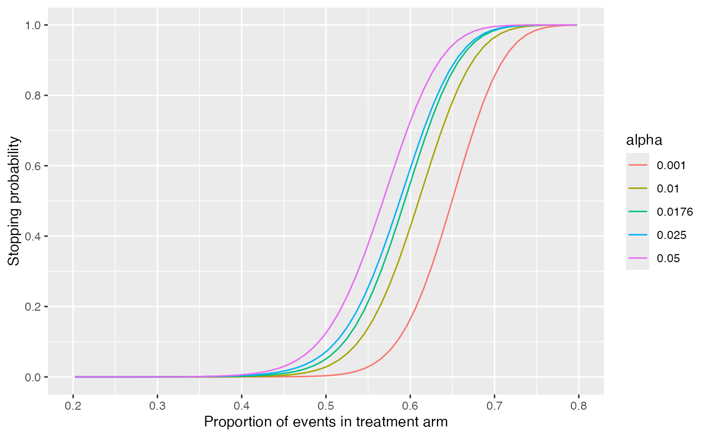

``` r


ggplot(hbd, aes(x = p, y = expected_events, colour=alpha)) + 
    geom_line() +
    ylab("Expected number of events") +
    xlab("Proportion of events in treatment arm") +
    scale_x_continuous(breaks=seq(0,1,by=0.1),limits=c(0.2,0.8)) +
    scale_y_continuous(limits=c(0, 150))
```

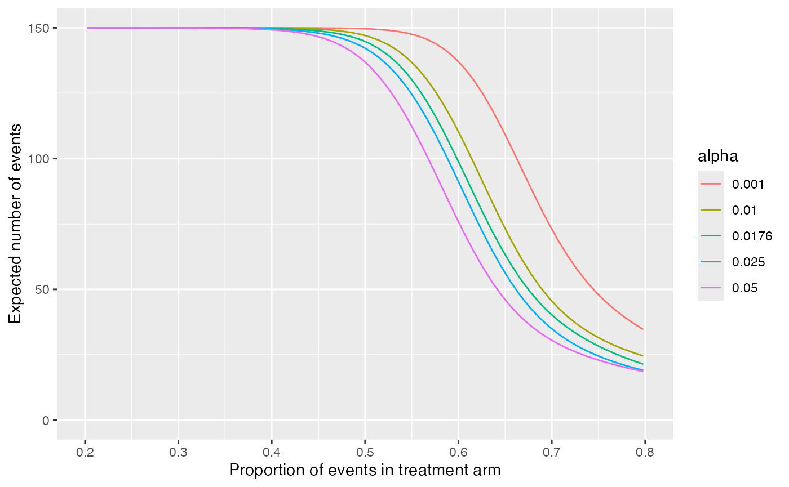

or on the transformed risk ratio scale:

``` r

alphaPerTest <- getAlphaPerTest(nevents = seq(10, 100, by = 10), pH0 = 0.5,
  alpha_total = 0.05)
alist<-c(0.001,0.01,alphaPerTest,0.025,0.05)

hbl<-lapply(alist,function(x)
  getHarmBound(nevents = seq(10, 100, by = 10), alpha_test = x, pH0 = 0.5,
  rrH1 = seq(0,10,l=100), maxevents = 150)$opchar)

hbd<-data.frame(do.call(rbind,hbl),alpha=rep(alist,each=nrow(hbl[[1]])))
hbd$alpha<-as.factor(round(hbd$alpha,4))
hbd$lrr<-log(hbd$rr)

ggplot(hbd, aes(x = rr, y = cum_stop_prob, colour=alpha)) + 
    geom_line() +
    ylab("Stopping probability") +
    xlab("Risk ratio (treatment/control)") +
    scale_x_continuous(trans='log', breaks=c(0.5,0.75,1,1.5,2,3,4),
      minor_breaks=NULL,limits=c(0.5,5)) +
    scale_y_continuous(breaks=seq(0,1,by=0.2))
```

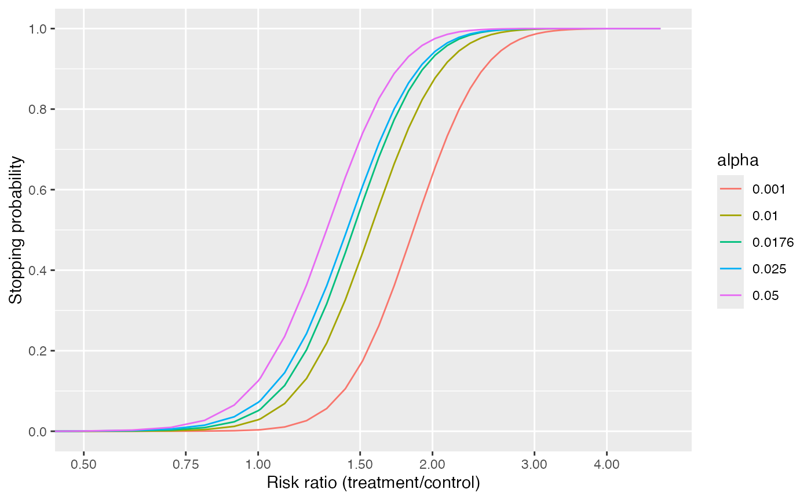

The test-wise alpha that leads to a reasonable stopping probability
under an appropriate alternative can be selected. However, the steepness
of the curve is not influenced by the alpha. We can only choose between
making more type I or II errors but not reduce the overall error rate.

We could e.g. specify that at least 70% of the trials should be stopped
if the risk of having a safety event increase by half (i.e. a risk ratio
of 1.5), i.e. a test-wise alpha of close to 0.05. However, this would
also lead to a stopping of 12.5% of the trials under the null.

On the other hand, if we control the type I error at 5% using a
test-wise alpha of 0.0176, only 55% of the trials are stopped if there
is a safety problem with a risk ratio of 1.5.

## Further paramaters

The number of interim analyses has some impact on steepness and location
of the curve, but it is rather limited, as long as the last interim
analysis is at the same time point.

``` r

nelist<-list(c(100),c(50,100),c(10,20,50,100),
             seq(10, 100, by = 10),seq(10, 100, by = 1))

hbl<-lapply(nelist,function(x)
  getHarmBound(nevents = x, alpha_test = 0.025, pH0 = 0.5,
    pH1 = seq(0,1,l=100), maxevents = 150)$opchar)

nis<-unlist(lapply(nelist,length))
net<-unlist(lapply(nelist,function(x) paste(x,collapse = "/")))
net[[length(net)-1]]<-"every 10"
net[[length(net)]]<-"continous"
nism<-paste0(nis," (",net,")")
hbd<-data.frame(do.call(rbind,hbl),ni=rep(nism,each=nrow(hbl[[1]])))
hbd$ni<-factor(hbd$ni,levels=nism)

ggplot(hbd, aes(x = p, y = cum_stop_prob, colour=ni)) + 
    geom_line() +
    ylab("Stopping probability") +
    xlab("Proportion of events in treatment arm") +
    scale_x_continuous(breaks=seq(0,1,by=0.1),limits=c(0.2,0.8)) +
    scale_y_continuous(breaks=seq(0,1,by=0.2)) +
    labs(colour="Number of IAs")
```

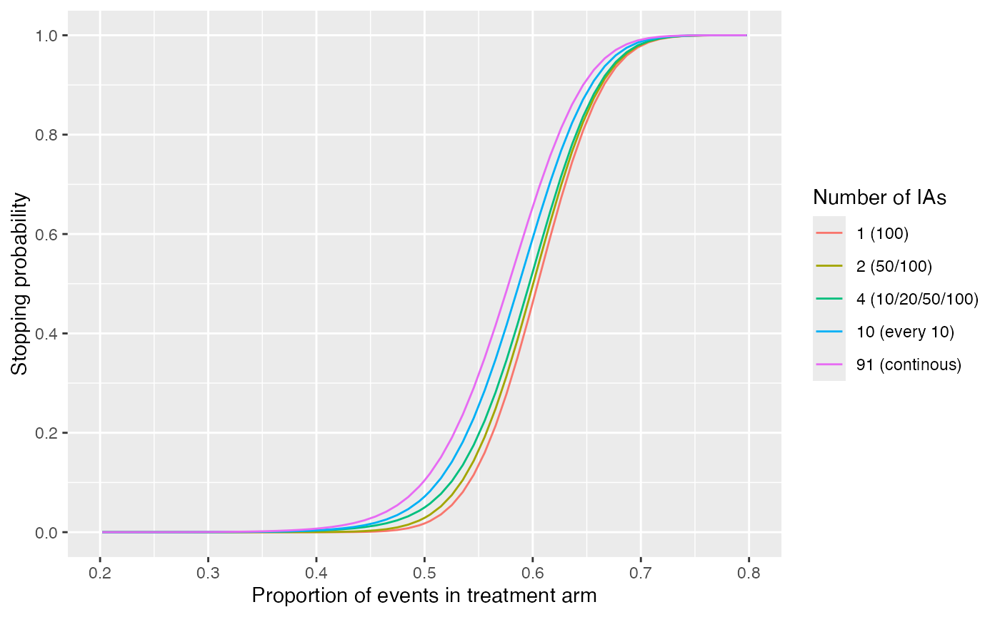

To substantially decrease the total error rates (i.e. get steeper
curves), we would need a higher total number of events:

``` r


nelist<-list(seq(10, 20, by = 10),seq(10, 50, by = 10), seq(10, 100, by = 10), 
  seq(10, 200, by = 10))

hbl<-lapply(nelist,function(x)
  getHarmBound(nevents = x, alpha_test = 0.025, pH0 = 0.5,
  pH1 = seq(0,1,l=100))$opchar)

nis<-unlist(lapply(nelist,max))
hbd<-data.frame(do.call(rbind,hbl),ni=rep(nis,each=nrow(hbl[[1]])))
hbd$ni<-as.factor(hbd$ni)

ggplot(hbd, aes(x = p, y = cum_stop_prob, colour=ni)) + 
    geom_line() +
    ylab("Stopping probability") +
     xlab("Proportion of events in treatment arm") +
    scale_x_continuous(breaks=seq(0,1,by=0.1),limits=c(0.2,0.8)) +
    scale_y_continuous(breaks=seq(0,1,by=0.2)) +
    labs(colour="Total number of events")
```

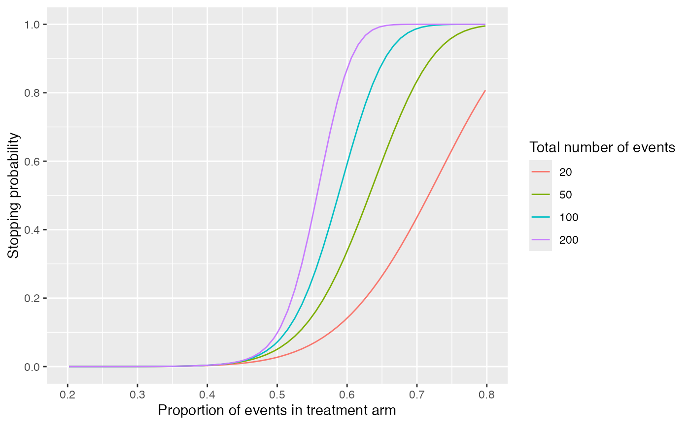

## Correlated data

If patients can have more than one event, the binomial boundaries are no
longer valid because the actual variance is increased. However, we can
use a beta-binomial framework. That needs the specification of a
intraclass correlation coefficient (*icc*).

The overdispersion factor (or design effect) by which the beta-binomial
variance exceeds the regular binomial variance corresponds to 1 +
(n - 1) \* icc and is printed by the function. Note that the effective
sample size is reduced by that factor which results in a substantial
loss of power, even for small ICCs.

For example, with an ICC of 0.05, we would only stop 19% of the trials
with 60% events in the treatment arm, compared to 59% without
correlation.

``` r

hb<-getHarmBound(nevents = seq(10, 100, by = 10), alpha_test = 0.025,
  pH0 = 0.5, pH1 = 0.6, maxevents = 150)
hb$opchar
#>     p cum_stop_prob expected_events hyp
#> 1 0.5    0.07163432        142.2242  H0
#> 2 0.6    0.59188721         91.2001  H1

hb<-getHarmBound(nevents = seq(10, 100, by = 10), alpha_test = 0.025,
  pH0 = 0.5, pH1 = 0.6, maxevents = 150, icc = 0.05)
#> [1] "Overdispersion factor: 1.45, 1.95, 2.45, 2.95, 3.45, 3.95, 4.45, 4.95, 5.45, 5.95"
hb$opchar
#>     p cum_stop_prob expected_events hyp
#> 1 0.5    0.04807753        144.5795  H0
#> 2 0.6    0.18755067        128.8848  H1
```

The effective sample size can be calculated using the overdispersion
factor, which captures the increase in variance due to the correlation
(the design effect). With an ICC of 0.05, the effective sample size is
much smaller than the number of events:

``` r

nevents<-seq(10, 100, by = 10)
#overdispersion
ods<-1 + (nevents - 1) * 0.05
ods 
#>  [1] 1.45 1.95 2.45 2.95 3.45 3.95 4.45 4.95 5.45 5.95
#effective sample size:
round(nevents/ods)
#>  [1]  7 10 12 14 14 15 16 16 17 17
```

We can plot this loss of power for different ICCs:

``` r

iccs<-c(0,0.01,0.02,0.05,0.1)

hbl<-lapply(iccs,function(x)
  getHarmBound(nevents = seq(10, 100, by = 10), alpha_test = 0.025,
  pH0 = 0.5, pH1 = seq(0,1,l=100), maxevents = 150, icc = x)$opchar)

hbd<-data.frame(do.call(rbind,hbl),icc=rep(iccs,each=nrow(hbl[[1]])))
hbd$icc<-as.factor(round(hbd$icc,2))

ggplot(hbd, aes(x = p, y = cum_stop_prob, colour=icc)) + 
    geom_line() +
    ylab("Stopping probability") +
    xlab("Proportion of events in treatment arm") +
    scale_x_continuous(breaks=seq(0,1,by=0.1),limits=c(0.2,0.8)) +
    scale_y_continuous(breaks=seq(0,1,by=0.2))
```

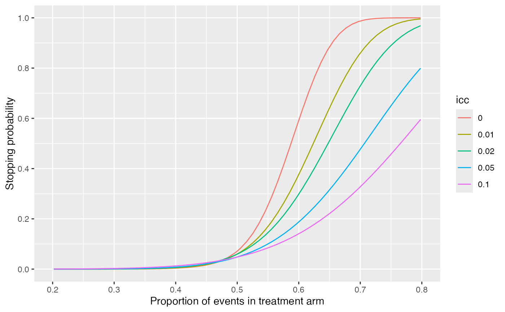
