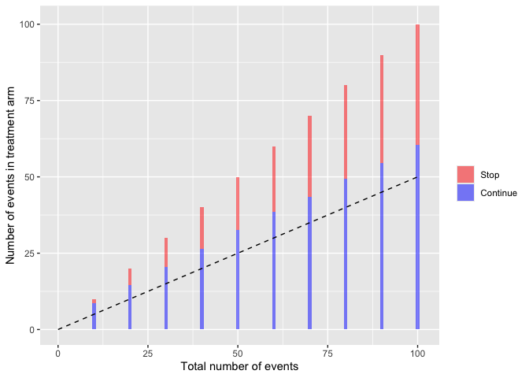
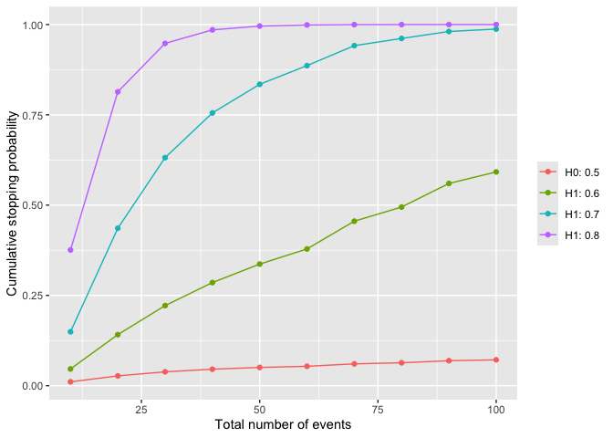

# harmBounds

The harmBounds package calculates stopping probabilities, defines
stopping boundaries and generates plots for safety monitoring using an
event based approach.

## Installation

The package can be installed from [GitHub](https://github.com/):

``` r

# install.packages("devtools")
remotes::install_github("dcr-unibe-ch/harmBounds")

# load package
library(harmBounds)
```

## Basic usage

### Stopping boundaries

``` r

hb<-getHarmBound(nevents = seq(10, 100, by = 10), alpha_test = 0.025, pH0 = 0.5,
  maxevents = 150)
plot(hb)
```



### Operating characteristics

Stopping probabilities and expected number of events can be obtained for
alternative scenarios.

``` r

hb<-getHarmBound(nevents = seq(10, 100, by = 10), alpha_test = 0.025, 
  pH0 = 0.5, pH1 = c(0.6, 0.7, 0.8) , maxevents = 150)
plot(hb, which = "cum_stopping")
```



The above example only scratches the surface of what `harmBounds` can
do. Check the vignette for further examples.
